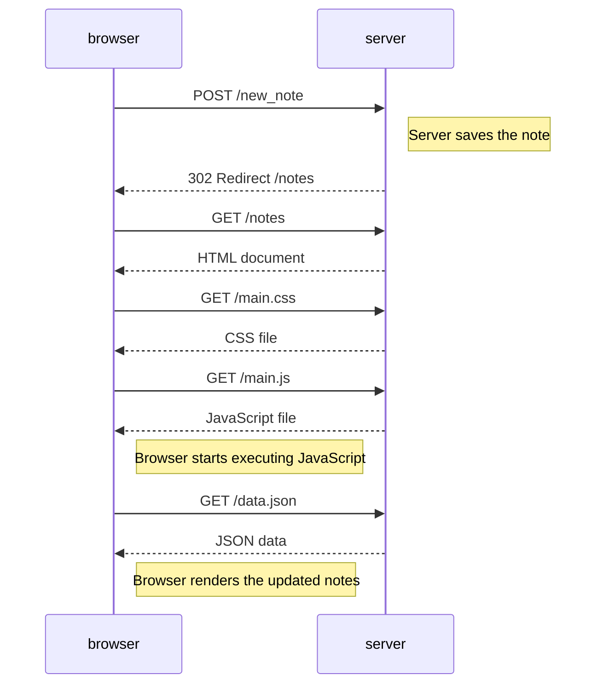

```mermaid
sequenceDiagram
    participant browser
    participant server

    browser->>server: POST /new_note
    Note right of server: Server saves the note

    server-->>browser: 302 Redirect /notes

    browser->>server: GET /notes
    server-->>browser: HTML document

    browser->>server: GET /main.css
    server-->>browser: CSS file

    browser->>server: GET /main.js
    server-->>browser: JavaScript file

    Note right of browser: Browser starts executing JavaScript

    browser->>server: GET /data.json
    server-->>browser: JSON data

    Note right of browser: Browser renders the updated notes
```
