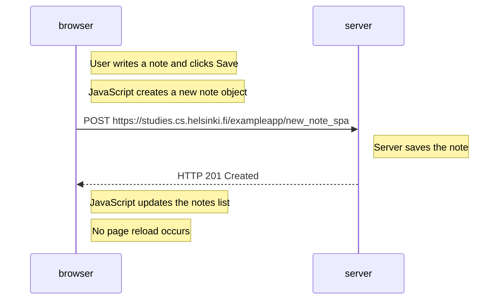

```mermaid
sequenceDiagram
    participant browser
    participant server

    Note right of browser: User writes a note and clicks Save

    Note right of browser: JavaScript creates a new note object

    browser->>server: POST https://studies.cs.helsinki.fi/exampleapp/new_note_spa
    Note right of server: Server saves the note

    server-->>browser: HTTP 201 Created

    Note right of browser: JavaScript updates the notes list

    Note right of browser: No page reload occurs
```
